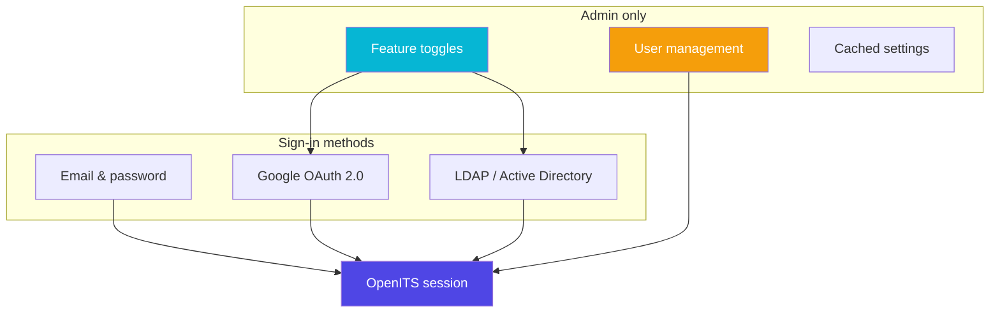
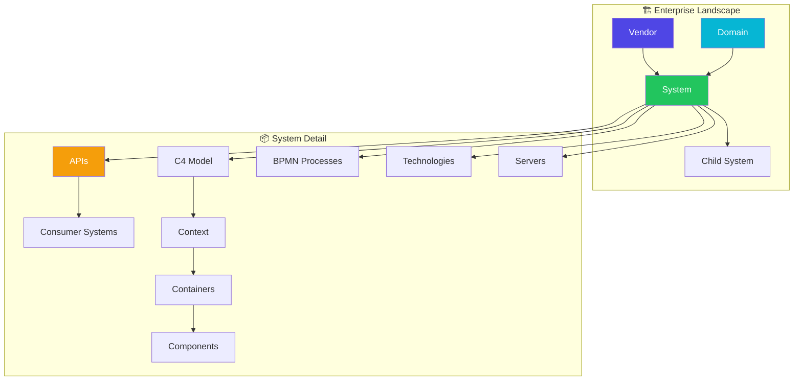
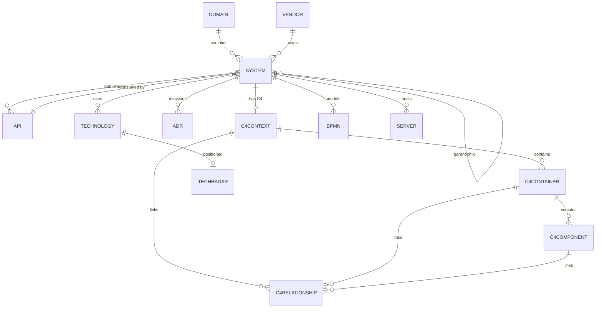
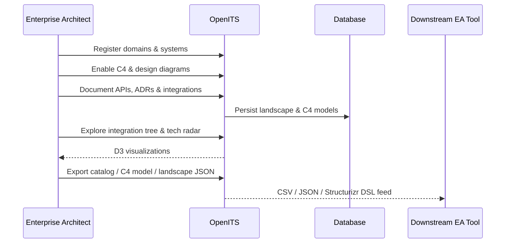
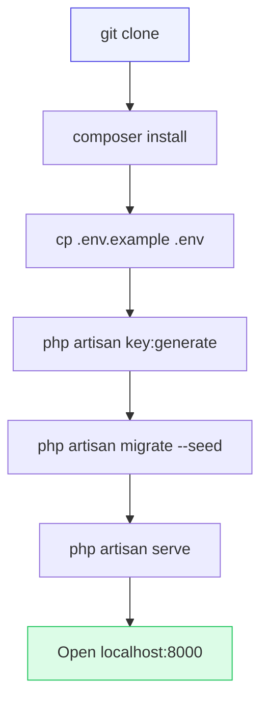
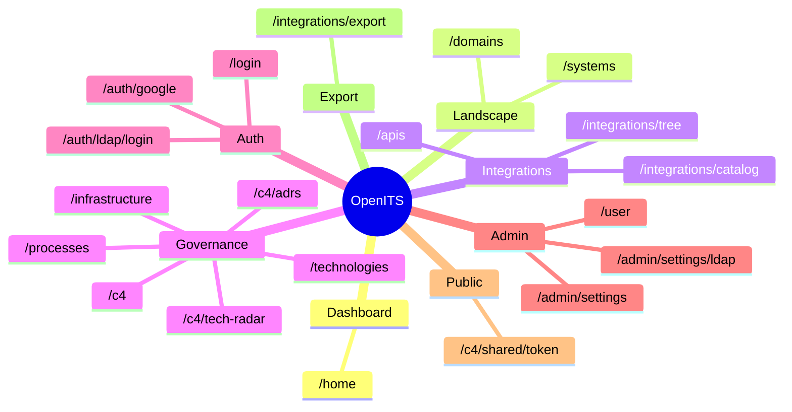
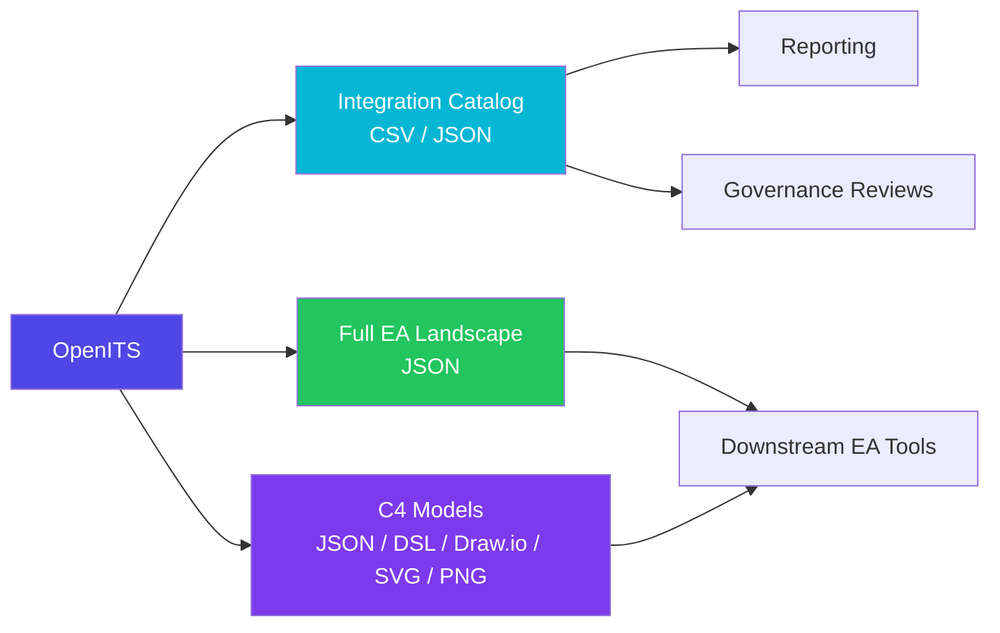

<div align="center">


# OpenITS

**Open-source enterprise architecture & integration documentation platform**

Model your IT landscape, design **C4 architecture diagrams**, document multi-protocol APIs, map cross-system integrations, capture **ADRs**, and govern your **technology radar** — in one self-hosted workspace.

<br/>


<br/>

[](LICENSE)
[](https://www.bestpractices.dev/projects/13354)
[](https://openits.ir)
[](https://www.php.net/)
[](https://laravel.com/)
[](https://www.mysql.com/)
[](https://www.sqlite.org/)

<br/>

[]()
[]()
[]()
[]()
[]()
[]()
[]()

<br/>

[Features](#features) ·
[C4 Architecture](#c4-architecture) ·
[Authentication](#authentication) ·
[Security](#security) ·
[Live Demo](https://openits.ir) ·
[How It Works](#how-it-works) ·
[Obtaining OpenITS](#obtaining-openits) ·
[Quick Start](#quick-start) ·
[Basic Usage](#basic-usage) ·
[Build & Test](#build--test) ·
[Documentation](#documentation) ·
[Architecture](#architecture-model) ·
[Logo & Brand](#logo--brand-assets) ·
[Contributing](#contributing) ·
[License](#license)

</div>

---

## About

**OpenITS** is a self-hosted platform for enterprise architects, integration teams, and platform engineers who need a single source of truth for their application landscape.

### The problem

Enterprise IT documentation is often scattered across wikis, spreadsheets, diagramming tools, and API portals. Teams struggle to answer basic questions: *Which systems integrate? What APIs exist? What is the current architecture? Who owns what?* OpenITS solves this by combining **landscape modeling**, **C4 architecture diagrams**, **multi-protocol API documentation**, **integration mapping**, **ADRs**, and **technology governance** in one self-hosted workspace you control.

### What OpenITS does

| Capability | Outcome |
|------------|---------|
| Model domains, vendors, and systems | Hierarchical application landscape |
| Design C4 diagrams (Context → Container → Component) | Visual architecture per system |
| Document REST, SOAP, GraphQL, gRPC, and more | Single API catalog with live specs |
| Map cross-system integrations | Integration tree and exportable catalog |
| Capture ADRs and tech-radar positions | Architecture governance and decisions |
| Import/export OpenAPI, Structurizr, JSON, Draw.io | Interoperability with existing EA tools |

<table align="center">
  <tr>
    <td align="center" width="160">
      <br/>
      <b>Model with C4</b><br/>
      <sub>Context · Container · Component diagrams</sub>
    </td>
    <td align="center" width="160">
      <br/>
      <b>Document</b><br/>
      <sub>APIs, ADRs &amp; live markdown</sub>
    </td>
    <td align="center" width="160">
      <br/>
      <b>Visualize</b><br/>
      <sub>Integration tree, C4 &amp; tech radar</sub>
    </td>
    <td align="center" width="160">
      <br/>
      <b>Collaborate</b><br/>
      <sub>Comments, change reviews &amp; snapshots</sub>
    </td>
    <td align="center" width="160">
      <br/>
      <b>Govern</b><br/>
      <sub>Domains, stacks &amp; infrastructure</sub>
    </td>
    <td align="center" width="160">
      <br/>
      <b>Import &amp; Export</b><br/>
      <sub>OpenAPI, Structurizr, JSON, Draw.io</sub>
    </td>
  </tr>
</table>

---

## How it works

```mermaid
flowchart LR
    A[🏢 Model Landscape] --> B[🏗️ Design C4 Diagrams]
    B --> C[📋 Document APIs & ADRs]
    C --> D[🔗 Map Integrations]
    D --> E[🌳 Visualize & Collaborate]
    E --> F[📤 Import / Export]

    style A fill:#eef2ff,stroke:#4f46e5
    style B fill:#ede9fe,stroke:#7c3aed
    style C fill:#ecfeff,stroke:#06b6d4
    style D fill:#f0fdf4,stroke:#22c55e
    style E fill:#fef3c7,stroke:#f59e0b
    style F fill:#fce7f3,stroke:#ec4899
```



<table align="center">
  <tr>
    <td align="center" width="100">
      <br/>
      <b>1 · Model</b><br/>
      <sub>Domains &amp; systems</sub>
    </td>
    <td align="center" width="20">→</td>
    <td align="center" width="100">
      <br/>
      <b>2 · C4</b><br/>
      <sub>Context → Container → Component</sub>
    </td>
    <td align="center" width="20">→</td>
    <td align="center" width="100">
      <br/>
      <b>3 · Document</b><br/>
      <sub>APIs &amp; ADRs</sub>
    </td>
    <td align="center" width="20">→</td>
    <td align="center" width="100">
      <br/>
      <b>4 · Connect</b><br/>
      <sub>Integration links</sub>
    </td>
    <td align="center" width="20">→</td>
    <td align="center" width="100">
      <br/>
      <b>5 · Visualize</b><br/>
      <sub>Tree &amp; tech radar</sub>
    </td>
    <td align="center" width="20">→</td>
    <td align="center" width="100">
      <br/>
      <b>6 · Export</b><br/>
      <sub>Catalog &amp; C4 models</sub>
    </td>
  </tr>
</table>

---

## Features

<table>
  <tr>
    <td width="50%" valign="top">
      
      <b>Business domains</b><br/>
      Partition the landscape — Enterprise, Marketing, Network, Infrastructure, or custom domains.
    </td>
    <td width="50%" valign="top">
      
      <b>Vendors & systems</b><br/>
      Hierarchical application landscape with parent/child system relationships.
    </td>
  </tr>
  <tr>
    <td valign="top">
      
      <b>API & integration docs</b><br/>
      REST, SOAP, GraphQL, gRPC, WebSocket, SSE, Socket.IO, SFTP, FTPS, Zabbix, SIEM, Splunk.
    </td>
    <td valign="top">
      
      <b>Integration tree</b><br/>
      Interactive D3 visualization: Vendor → System → API → consumer systems.
    </td>
  </tr>
  <tr>
    <td valign="top">
      
      <b>Integration catalog</b><br/>
      Filterable table of all integration links with CSV/JSON export.
    </td>
    <td valign="top">
      
      <b>BPMN & sequence diagrams</b><br/>
      Process models and Mermaid-based API/integration message flow designer.
    </td>
  </tr>
  <tr>
    <td valign="top">
      
      <b>Technology stack</b><br/>
      Per-system catalog — languages, frameworks, databases, messaging, cloud.
    </td>
    <td valign="top">
      
      <b>Infrastructure</b><br/>
      Server inventory per system — DB, app, web, cache, brokers, load balancers.
    </td>
  </tr>
  <tr>
    <td valign="top">
      
      <b>C4 architecture</b><br/>
      Context, container, and component diagrams per system with an interactive D3 editor — drag-and-drop, connect mode, undo/redo, mini-map, and drill-down.
    </td>
    <td valign="top">
      
      <b>Architectural Decision Records</b><br/>
      Capture ADRs with status lifecycle, timeline view, and links to systems and C4 elements.
    </td>
  </tr>
  <tr>
    <td valign="top">
      
      <b>Technology radar</b><br/>
      Position technologies on Adopt · Trial · Assess · Hold rings with an interactive chart and usage report.
    </td>
    <td valign="top">
      
      <b>Architecture collaboration</b><br/>
      Comment on diagram elements, submit change requests, and run approval workflows with version snapshots.
    </td>
  </tr>
  <tr>
    <td valign="top">
      
      <b>C4 import &amp; export</b><br/>
      Import OpenAPI, AsyncAPI, Structurizr DSL, and JSON backups. Export JSON, Structurizr DSL, Draw.io XML, SVG, and PNG.
    </td>
    <td valign="top">
      
      <b>API → C4 auto-sync</b><br/>
      OpenAPI documentation updates can automatically sync containers, components, and relationships into C4 models.
    </td>
  </tr>
  <tr>
    <td valign="top" colspan="2">
      <b>🔐 Enterprise authentication</b><br/>
      Email/password, optional Google OAuth 2.0, and LDAP / Active Directory — with <b>admin-only</b> settings, brute-force protection, controlled user provisioning, Sanctum API tokens, LDAP audit logging, and security headers.
    </td>
  </tr>
</table>

---

## Authentication

OpenITS supports multiple sign-in methods. Local email/password login is always available; Google OAuth and LDAP / Active Directory are optional and can be enabled or disabled from the **admin settings** panel (`/admin/settings`).

> **Access control:** Admin settings, LDAP management, and user CRUD require an account with `is_admin = true`. Self-service registration is **disabled by default** (`REGISTRATION_ENABLED=false`).



| Method | Description |
|--------|-------------|
| **Email & password** | Built-in Laravel authentication with per-email and per-IP rate limiting |
| **Google OAuth 2.0** | Optional social login; provisioning and domain allowlists are configurable |
| **LDAP / Active Directory** | Optional directory login for AD and OpenLDAP, with LDAPS/STARTTLS support |

### Default admin account

After `php artisan db:seed`, sign in with the seeded administrator (local environment only shows demo credentials on the login page):

| Field | Value |
|-------|-------|
| Email | `admin@openits.local` |
| Password | `password` |

Change this password immediately in production. To promote another user:

```sql
UPDATE users SET is_admin = 1 WHERE email = 'you@company.com';
```

### Google OAuth

1. Create OAuth credentials in [Google Cloud Console](https://console.cloud.google.com/)
2. Add the redirect URI: `{APP_URL}/auth/google/callback`
3. Configure `.env`:

```env
GOOGLE_CLIENT_ID=your-client-id
GOOGLE_CLIENT_SECRET=your-client-secret
GOOGLE_REDIRECT_URI="${APP_URL}/auth/google/callback"
GOOGLE_LOGIN_ENABLED=false
GOOGLE_AUTO_PROVISION=false
GOOGLE_ALLOW_EMAIL_LINKING=false
GOOGLE_ALLOWED_DOMAINS=yourcompany.com
```

| Variable | Purpose |
|----------|---------|
| `GOOGLE_AUTO_PROVISION` | When `false`, only users already in the database can sign in via Google |
| `GOOGLE_ALLOW_EMAIL_LINKING` | When `false`, Google accounts are not auto-linked to existing local users by email |
| `GOOGLE_ALLOWED_DOMAINS` | Comma-separated email domains allowed to sign in (empty = no restriction) |

4. Enable from **Admin → Settings**, or run:

```bash
php artisan google:login:status --enable
```

| Route | Purpose |
|-------|---------|
| `GET /auth/google` | OAuth redirect |
| `GET /auth/google/callback` | OAuth callback |
| `GET /auth/google/status` | Public feature status |
| `POST /api/auth/google/login` | API login with access token |

### LDAP / Active Directory

Directory authentication uses native PHP LDAP functions (`ldap_connect`, `ldap_bind`, `ldap_search`) and supports both **Active Directory** and **OpenLDAP**.

**Requirements:** PHP `ldap` extension (`php-ldap` on Linux). For production, use **LDAPS** or **STARTTLS** (`LDAP_USE_SSL=true` or `LDAP_USE_STARTTLS=true`) and keep `LDAP_ALLOW_INSECURE=false`.

1. Configure `.env`:

```env
LDAP_LOGIN_ENABLED=false
LDAP_SERVER=ldap.example.com
LDAP_PORT=389
LDAP_BASE_DN=DC=example,DC=com
LDAP_DOMAIN=example.com
LDAP_USE_SSL=false
LDAP_USE_STARTTLS=false
LDAP_ALLOW_INSECURE=false
LDAP_BIND_DN=CN=Service Account,DC=example,DC=com
LDAP_BIND_PASSWORD=secret
LDAP_TYPE=ad
LDAP_AUTO_PROVISION=false
LDAP_ALLOW_EMAIL_LINKING=false
LDAP_ALLOWED_GROUPS=CN=OpenITS-Users,OU=Groups,DC=example,DC=com
```

| Variable | Purpose |
|----------|---------|
| `LDAP_AUTO_PROVISION` | When `false`, only users already in the database (or synced) can sign in |
| `LDAP_ALLOW_EMAIL_LINKING` | When `false`, LDAP accounts are not auto-linked to local users by email |
| `LDAP_ALLOWED_GROUPS` | Comma-separated group DNs; user must belong to at least one (empty = no group check) |
| `LDAP_ALLOW_INSECURE` | Must be `false` in production; blocks cleartext LDAP when SSL/STARTTLS is off |

2. Open **Admin → Settings → Configure LDAP**, enter server details, **Test Connection**, then enable LDAP login.
3. Optionally sync directory users in bulk (queued job):

```bash
php artisan ldap:sync          # run synchronously
php artisan ldap:sync --queue  # dispatch to queue
```

| Artisan command | Description |
|-----------------|-------------|
| `php artisan ldap:test` | Test LDAP connectivity |
| `php artisan ldap:status` | Show enabled status and configuration |
| `php artisan ldap:enable` | Enable LDAP login |
| `php artisan ldap:disable` | Disable LDAP login |
| `php artisan ldap:sync` | Sync all directory users locally |

| Route | Purpose |
|-------|---------|
| `POST /auth/ldap/login` | Web LDAP login |
| `GET /auth/ldap/status` | Public feature status |
| `POST /api/auth/ldap` | API LDAP login (returns Sanctum token) |
| `GET /admin/settings/ldap` | LDAP admin settings page *(admin only)* |
| `POST /admin/ldap/test` | Test connection *(admin only; does not persist settings)* |
| `POST /admin/ldap/sync` | Queue user sync *(admin only)* |

**Login flow:** username + password → bind to LDAP → search user → find or update local user (if provisioned) → sign in. LDAP passwords are never stored in the database. All authentication attempts are recorded in the `ldap_logs` audit table. Failed attempts use a generic error message to prevent user enumeration.

When LDAP is disabled, the login form is hidden and LDAP routes return **403** (API) or redirect to login (web). Local authentication remains available as a fallback.

### API tokens (Sanctum)

LDAP and Google API login endpoints return Sanctum bearer tokens. Configure expiration in `.env`:

```env
SANCTUM_EXPIRATION=1440
```

Tokens expire after the configured number of minutes (default: 24 hours).

---

## Security

OpenITS includes several controls aligned with common OWASP recommendations. Review and tune these before production. The formal **[security assurance case](ASSURANCE_CASE.md)** documents the threat model, trust boundaries, and how security requirements are met.

### Security considerations

**Do:**

- Set `APP_DEBUG=false` in production
- Use HTTPS with `SESSION_SECURE_COOKIE=true`
- Change the default admin password immediately after first login
- Use LDAPS or STARTTLS for directory authentication (`LDAP_USE_SSL=true` or `LDAP_USE_STARTTLS=true`)
- Keep `REGISTRATION_ENABLED=false` unless self-service sign-up is required
- Use Redis for `CACHE_STORE` in production (reliable rate limiting)
- Report vulnerabilities privately via [SECURITY.md](SECURITY.md)
- Store passwords with Laravel's bcrypt hasher (`BCRYPT_ROUNDS=12` default)

**Do not:**

- Expose `DEPLOYMENT_ENABLED=true` after initial setup (allows remote migrate/seed)
- Set `LDAP_ALLOW_INSECURE=true` in production (cleartext LDAP)
- Commit `.env` files or secrets to version control
- Disable rate limiting or security headers without justification
- Use MD5, SHA-1, DES, or RC4 for security-sensitive operations (OpenITS uses Laravel's standard bcrypt and `random_bytes()` instead)
- Report security issues in public GitHub Issues

### Brute-force protection

Login attempts are rate-limited via `LoginThrottleService` and `config/login.php`:

| Setting | Default | Scope |
|---------|---------|-------|
| `LOGIN_MAX_ATTEMPTS` | `5` | Per email/username + client IP |
| `LOGIN_DECAY_MINUTES` | `1` | Lockout window after limit is reached |
| `LOGIN_IP_MAX_ATTEMPTS` | `20` | Total failed attempts per IP (slows username spraying) |

Limits apply to **email/password**, **LDAP**, and **Google token** login. Successful logins clear the per-credential counter. Lockout messages are shown on the login page.

> Rate limits use your `CACHE_STORE` driver. Use **Redis** in production for reliable throttling under load.

### Access control

| Area | Protection |
|------|------------|
| Admin settings (`/admin/settings`, `/admin/settings/ldap`) | `is_admin` required |
| User management (`/user`) | `is_admin` required |
| C4 collaboration | Comment authors, assigned reviewers, or admins |
| C4 share links | Public read-only view; optional password gate |

### Registration & provisioning

```env
REGISTRATION_ENABLED=false
```

Keep registration disabled in production unless you explicitly need self-service sign-up. For LDAP and Google, enable `*_AUTO_PROVISION` only when you trust the identity provider and have group/domain restrictions in place.

### Transport & session hardening (production)

```env
APP_DEBUG=false
SESSION_ENCRYPT=true
SESSION_SECURE_COOKIE=true
LDAP_USE_SSL=true          # or LDAP_USE_STARTTLS=true
LDAP_ALLOW_INSECURE=false
DEPLOYMENT_ENABLED=false   # remote migrate/seed route — disable after initial setup
```

Additional protections enabled by default:

- **Security headers** — `X-Content-Type-Options`, `X-Frame-Options`, `Referrer-Policy`, HSTS (HTTPS only)
- **Session regeneration** on LDAP and Google login (mitigates session fixation)
- **LDAP filter escaping** — usernames are escaped before directory search
- **LDAP host validation** — admin connection tests block private/reserved addresses (SSRF mitigation)
- **Markdown XSS** — rendered markdown is sanitized with DOMPurify
- **Sanctum token expiration** — configurable API token lifetime

### C4 public share links

Password-protected diagram shares are available without authentication:

| Route | Purpose |
|-------|---------|
| `GET /c4/shared/{token}` | View shared diagram (password form if protected) |
| `POST /c4/shared/{token}` | Unlock password-protected share |

Create share links from the C4 editor while signed in.

---

## C4 Architecture

OpenITS includes an **IcePanel-style C4 modeling** workspace for enterprise architects. Each system can enable a C4 model with three diagram levels:

| Level | What you model |
|-------|----------------|
| **Context** | System, users, external systems, and high-level relationships |
| **Container** | Applications, databases, gateways, queues, and container-to-container links |
| **Component** | Internal components (controllers, services, repositories) inside a container |

### Interactive diagram editor

- D3.js + dagre layout with zoom, pan, and live mini-map
- Drag-to-connect relationships with protocol labels
- Element palette, properties panel, undo/redo
- Search across context, container, and component elements
- Collaboration panel: comments and architecture change-request reviews

### Import & export

| Direction | Formats |
|-----------|---------|
| **Import** | OpenAPI (`.json`, `.yaml`), AsyncAPI, Structurizr DSL, JSON backup |
| **Export** | JSON, Structurizr DSL, Draw.io XML, SVG, PNG |

Queued imports run in the background (`QUEUE_CONNECTION=database`). Start a worker in production:

```bash
php artisan queue:work
```

### ADRs & technology radar

- **`/c4/adrs`** — create, edit, and browse Architectural Decision Records; filter by status and system
- **`/c4/tech-radar`** — interactive radar chart across your technology catalog with click-to-select blips and zoom/pan

### Share links

From the C4 editor, generate a read-only share URL for context, container, or component diagrams. Links can include an optional password and expiry. Viewers access shared diagrams at `/c4/shared/{token}` without signing in.

### C4 routes

| Feature | Route |
|---------|-------|
| C4 model catalog | `/c4` |
| Context diagram | `/c4/systems/{system}/context` |
| Container diagram | `/c4/systems/{system}/containers` |
| Component diagram | `/c4/containers/{container}` |
| Import model | `POST /c4/systems/{system}/import` |
| Export model | `/c4/systems/{system}/export?format=json\|structurizr\|drawio` |
| ADRs | `/c4/adrs` |
| Tech radar | `/c4/tech-radar` |

### Tests

```bash
php artisan test --filter=C4
php artisan test --filter=LoginThrottle
php artisan test --filter=LdapAuth
```

---

## Architecture model





<details>
<summary><b>Text representation</b></summary>

```
Vendor
  └── System (domain, parent/child hierarchy)
        ├── C4 model (context → containers → components)
        ├── APIs (owner_system_id)
        │     └── consumer systems (api_system pivot)
        ├── ADRs (architectural decision records)
        ├── BPMN process / Sequence diagram
        ├── technologies (pivot) → technology radar
        └── servers

Domain
  └── systems
```

</details>

---

## Integration flow



---

## Obtaining OpenITS

| Method | Instructions |
|--------|--------------|
| **Git clone** | `git clone https://github.com/imRezaAlie/openits.git` |
| **GitHub** | [github.com/imRezaAlie/openits](https://github.com/imRezaAlie/openits) |
| **Live demo** | [openits.ir](https://openits.ir) (hosted instance; not a download) |

OpenITS is open-source software under the [Apache License 2.0](LICENSE). Install by cloning the repository and following [Quick start](#quick-start) (`git clone` + `composer install`, the standard PHP/Laravel convention). To remove an installation, see [Uninstall](#uninstall).

### Bug reports

Report bugs via **[GitHub Issues](https://github.com/imRezaAlie/openits/issues/new/choose)** using the bug report template. Include steps to reproduce, expected vs. actual behavior, and your environment (PHP version, database, commit hash).

**Response policy:** Maintainers aim to acknowledge new issues within **5 business days**. Security vulnerabilities must **not** be reported in public issues — see [SECURITY.md](SECURITY.md).

### Contributing

Contributions are welcome. Read [CONTRIBUTING.md](CONTRIBUTING.md#development-setup) for quick developer setup (install dependencies, database, and test suite).

---

## Requirements

<table align="center">
  <tr>
    <td align="center"></td>
    <td align="center"></td>
    <td align="center"></td>
    <td align="center"></td>
    <td align="center"></td>
  </tr>
</table>

| Dependency | Version |
|------------|---------|
| PHP | 8.2 or higher |
| Composer | Latest stable |
| Database | MySQL 8+ or SQLite |
| Node.js | 20+ *(optional, for Vite asset builds; CI uses Node.js 24)* |
| PHP LDAP extension | Optional *(required for LDAP / Active Directory login)* |

**External dependencies (machine-readable):** PHP libraries are declared in [composer.json](composer.json) with locked versions in [composer.lock](composer.lock). Optional frontend build dependencies are in [package.json](package.json) and [package-lock.json](package-lock.json). Install with `composer install` and, if building assets, `npm ci`. How to identify and update reused components is in [SECURITY.md § Updateable reused components](SECURITY.md#updateable-reused-components). Vulnerability monitoring is in [SECURITY.md § Dependency monitoring](SECURITY.md#dependency-monitoring).

---

## Quick start

> **Live demo:** [https://openits.ir](https://openits.ir)



### 1. Clone & install

```bash
git clone https://github.com/imRezaAlie/openits.git
cd openits
composer install
```

### 2. Configure environment

```bash
cp .env.example .env
php artisan key:generate
```

Edit `.env` and set your database credentials:

```env
DB_CONNECTION=mysql
DB_HOST=127.0.0.1
DB_PORT=3306
DB_DATABASE=openits
DB_USERNAME=root
DB_PASSWORD=
```

Optional: configure [Google OAuth](#google-oauth), [LDAP / Active Directory](#ldap--active-directory), or [security settings](#security) in `.env`, then enable providers from **Admin → Settings** (admin account required).

### 3. Migrate & seed

```bash
php artisan migrate
php artisan db:seed
```

### 4. Run

```bash
php artisan serve
```

Open **[http://localhost:8000](http://localhost:8000)** and sign in with the [default admin account](#default-admin-account).

To allow self-service sign-up in development, set `REGISTRATION_ENABLED=true` in `.env` and visit `/register`.

For C4 imports and LDAP sync in production, run a queue worker:

```bash
php artisan queue:work
```

### Frontend assets *(optional)*

```bash
npm install
npm run build   # production build
npm run dev     # development with hot reload
```

### Uninstall

OpenITS is installed as a self-hosted PHP application (no system package manager). To remove it:

1. **Stop services** — stop the web server vhost, `php artisan serve`, and any `queue:work` processes or supervisor units.
2. **Back up** *(optional)* — export the database and copy `storage/` if you may need data later.
3. **Remove the database** — drop the MySQL database or delete the SQLite file configured in `.env`.
4. **Delete the application** — remove the cloned directory (e.g. `rm -rf openits` on Linux/macOS, or delete the folder on Windows).
5. **Remove web server config** — delete the Nginx/Apache site configuration if you added one.

There is no separate uninstaller binary; this follows the usual convention for Composer-based Laravel deployments.

---

## Basic usage

After signing in (see [default admin account](#default-admin-account)), use the sidebar to navigate the platform.

### Register a system and document an API

1. Go to **Domains** → create a domain (e.g., "Enterprise").
2. Go to **Systems** → **Add system** → assign domain and vendor.
3. Go to **APIs** → **Add API** → choose protocol (REST, SOAP, GraphQL, etc.) and fill in endpoints.
4. Open the API detail page to view the generated OpenAPI/Swagger documentation.

### Enable C4 architecture for a system

1. Open a system → enable **C4 model**.
2. Navigate to **C4** → select the system → open **Context** diagram.
3. Add users, external systems, and relationships using the interactive editor.
4. Drill down to **Container** and **Component** levels.

### Explore integrations

1. Go to **Integrations → Tree** for the D3 visualization (Vendor → System → API → consumers).
2. Go to **Integrations → Catalog** for a filterable table with CSV/JSON export.

### Export data

```bash
# Via browser (authenticated):
# Integration catalog: /integrations/catalog/export
# Full landscape JSON: /integrations/export
# C4 model JSON: /c4/systems/{id}/export?format=json
```

### LDAP administration (CLI)

```bash
php artisan ldap:test      # verify directory connectivity
php artisan ldap:sync      # sync users from LDAP
php artisan ldap:status    # show current configuration
```

See [docs/](docs/) for full API, CLI, and service reference documentation.

---

## Build & test

### Build from source

OpenITS is a PHP/Laravel application. The build installs dependencies and bundles frontend assets; it does **not** compile native binaries (no Makefile, CMake, or autotools). There is no recursive subdirectory build with cross-dependencies. Compiler variables such as `CC` / `CFLAGS` are not applicable, and there is no install step that strips native debugging symbols (e.g. `install -s`). The application runs from **PHP source** (a scripting language); there is no bit-for-bit reproducible compilation step for shipped binaries. Installation does not use a POSIX `make install` or `DESTDIR` target — you choose the deployment directory when cloning the repository (see [Quick start](#quick-start)).

```bash
composer install          # PHP dependencies
npm install && npm run build   # frontend assets (optional)
php artisan migrate       # database schema
```

### Upgrading

To upgrade an existing installation, see **[UPGRADING.md](UPGRADING.md)** (backup, `git pull`, `composer install`, `php artisan migrate`, cache rebuild, and version notes). Upgrading from Laravel 11 requires `laravel/framework` **12.61.1+** (security advisories) and `owen-it/laravel-auditing` **14.x**.

### Run tests

```bash
composer test             # run full PHPUnit suite
# or
php artisan test
```

The [Tests GitHub Actions workflow](.github/workflows/tests.yml) runs `composer test` on every push and pull request to `main` and publishes a pass/fail report in the Actions tab.

Run a subset:

```bash
php artisan test --filter=C4
php artisan test --filter=LdapAuth
```

**Test policy:** New major functionality should include automated tests. See [CONTRIBUTING.md](CONTRIBUTING.md#test-policy).

### Linting

Code style is enforced with [Laravel Pint](https://laravel.com/docs/pint) (PSR-12). The [Lint GitHub Actions workflow](.github/workflows/lint.yml) runs `composer lint` automatically on pushes and pull requests to `main`:

```bash
composer lint             # check style (no changes)
composer lint:fix         # auto-fix style issues
```

### Dependency audit

PHP and npm dependencies are checked for known vulnerabilities in the [Dependency audit workflow](.github/workflows/audit.yml) (`composer audit` and `npm audit --audit-level=critical`) on every push and pull request to `main`, plus a weekly scheduled run.

```bash
composer audit            # check PHP dependencies locally
npm audit                 # check frontend dependencies locally
```

---

## Documentation

| Document | Description |
|----------|-------------|
| [docs/README.md](docs/README.md) | Documentation index |
| [docs/API.md](docs/API.md) | REST API reference (authentication endpoints) |
| [docs/CLI.md](docs/CLI.md) | Artisan CLI commands and options |
| [docs/SERVICES.md](docs/SERVICES.md) | Public PHP service classes |
| [CONTRIBUTING.md](CONTRIBUTING.md) | Contribution guidelines and coding standards |
| [UPGRADING.md](UPGRADING.md) | Upgrade path and version notes |
| [GOVERNANCE.md](GOVERNANCE.md) | Project governance, roles, and decision-making |
| [ROADMAP.md](ROADMAP.md) | 12-month roadmap (planned and out-of-scope work) |
| [CODE_OF_CONDUCT.md](CODE_OF_CONDUCT.md) | Community code of conduct |
| [SECURITY.md](SECURITY.md) | Vulnerability reporting and crypto practices |
| [ASSURANCE_CASE.md](ASSURANCE_CASE.md) | Security assurance case (threat model, trust boundaries) |

---

## Demo data

Seeders populate a realistic enterprise scenario — Salesforce, SAP, Stripe, multi-protocol APIs, cross-domain integrations, sample C4 models, and technology radar positions:

```bash
php artisan db:seed
```

This also creates the default admin user (`admin@openits.local` / `password` with `is_admin = true`) and a non-admin test user.

Optional seeders:

```bash
php artisan db:seed --class=C4Seeder
php artisan db:seed --class=AdrSeeder
```

---

## Key routes



| Feature | Route |
|---------|-------|
| Dashboard | `/home` |
| Domains | `/domains` |
| Systems | `/systems` |
| API documentation | `/apis` |
| Integration tree | `/integrations/tree` |
| Integration catalog | `/integrations/catalog` |
| Full landscape export (JSON) | `/integrations/export` |
| BPMN processes | `/processes` |
| Technologies | `/technologies` |
| Infrastructure | `/infrastructure` |
| C4 architecture catalog | `/c4` |
| C4 context diagram | `/c4/systems/{system}/context` |
| C4 container diagram | `/c4/systems/{system}/containers` |
| C4 component diagram | `/c4/containers/{container}` |
| Architectural Decision Records | `/c4/adrs` |
| Technology radar | `/c4/tech-radar` |
| Login | `/login` |
| Google OAuth | `/auth/google` |
| LDAP login | `POST /auth/ldap/login` |
| Admin settings | `/admin/settings` *(admin only)* |
| LDAP settings | `/admin/settings/ldap` *(admin only)* |
| User management | `/user` *(admin only)* |
| C4 shared diagram | `/c4/shared/{token}` *(public; optional password)* |

> Most application routes require authentication. The landing page, login screen, auth provider status endpoints, and C4 share links are public. Google and LDAP login routes are blocked when their respective features are disabled. Admin routes require `is_admin = true`.

---

## Export & integration



| Export | Endpoint | Format |
|--------|----------|--------|
| Integration catalog | `/integrations/catalog/export` | CSV / JSON |
| Full EA landscape | `/integrations/export` | JSON |
| C4 model | `/c4/systems/{system}/export?format=json` | JSON |
| C4 Structurizr DSL | `/c4/systems/{system}/export?format=structurizr` | `.dsl` text |
| C4 Draw.io | `/c4/systems/{system}/export?format=drawio` | Draw.io XML |

---

## Tech stack

<p align="center">
  
  
  
  
  
  
  
  
  
</p>

| Layer | Technologies |
|-------|--------------|
| **Backend** | Laravel 12, Eloquent, Blade, Sanctum, Socialite, Laravel Auditing |
| **Authentication** | Email/password, Google OAuth 2.0, LDAP / Active Directory, admin RBAC |
| **Security** | Login rate limiting, security headers, controlled provisioning, Sanctum expiration |
| **UI** | Bootstrap admin theme (Deznav), Alpine.js |
| **Visualization** | D3.js, dagre, BPMN.js, Swagger UI, Mermaid |
| **C4 modeling** | Context / container / component diagrams, import jobs, version snapshots |

---

## Logo & brand assets

Official OpenITS logos are included in the repository for use in documentation, presentations, and integrations.

<table align="center">
  <tr>
    <td align="center" width="280">
      
      <br/><sub><b>Color</b> — light backgrounds</sub>
    </td>
    <td align="center" width="280" bgcolor="#1e293b">
      
      <br/><sub><b>White</b> — dark backgrounds</sub>
    </td>
  </tr>
  <tr>
    <td align="center" colspan="2">
      <br/>
      
      <br/><sub><b>Full logo</b> — admin sidebar & print layouts</sub>
    </td>
  </tr>
</table>

| Asset | Path | Usage |
|-------|------|-------|
| Color logo | `public/landing/assets/img/logo-color.png` | Light backgrounds, README, docs |
| White logo | `public/readme/logo-white.svg` | Dark backgrounds, README |
| Full logo | `public/images/logo/logo-full.png` | Admin sidebar, print layouts |
| Compact logo | `public/images/small-logo.png` | Navbar, favicons, tight spaces |
| Favicon | `public/images/favicon.png` | Browser tab icon |
| README icons | `public/readme/*.svg` | Feature & workflow illustrations |

When referencing OpenITS in external materials, please use the **color logo** on light backgrounds and the **white logo** on dark backgrounds. Do not stretch, recolor, or modify the logo proportions.

---

## Contributing

Contributions are welcome! Please read **[CONTRIBUTING.md](CONTRIBUTING.md)** for full guidelines including coding standards, test policy, DCO sign-off, and pull request checklist.

Community standards: [CODE_OF_CONDUCT.md](CODE_OF_CONDUCT.md) · Governance: [GOVERNANCE.md](GOVERNANCE.md)

Quick start:

1. **Fork** the repository on GitHub
2. **Create** a feature branch (`git checkout -b feature/my-feature`)
3. **Write tests** for new major functionality
4. **Run** `composer test` and `composer lint`
5. **Open** a [Pull Request](https://github.com/imRezaAlie/openits/compare) with a clear description

For bugs, use the [bug report template](https://github.com/imRezaAlie/openits/issues/new/choose). For features, use the [feature request template](https://github.com/imRezaAlie/openits/issues/new/choose).

---

## License

OpenITS is open-source software licensed under the **[Apache License 2.0](LICENSE)**.

Copyright © 2026 Reza Alie

---

## Author

**Reza Alie**

- **Demo:** [openits.ir](https://openits.ir)
- **Website:** [rezaalie.ir](https://rezaalie.ir)
- **Email:** rezaalie70[at]gmail.com
- **LinkedIn:** [linkedin.com/in/rezaalie](https://www.linkedin.com/in/rezaalie)

---

<div align="center">


<br/><br/>

**[⬆ Back to top](#openits)**

<br/>

[Live Demo](https://openits.ir) · [Report a bug](https://github.com/imRezaAlie/openits/issues) · [Request a feature](https://github.com/imRezaAlie/openits/issues) · [Discussions](https://github.com/imRezaAlie/openits/discussions)

<br/>

[Website](https://rezaalie.ir) · [LinkedIn](https://www.linkedin.com/in/rezaalie) · rezaalie70[at]gmail.com

</div>
