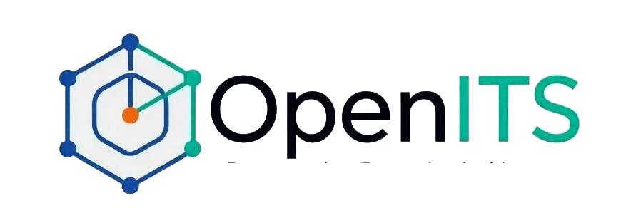
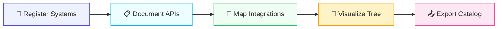
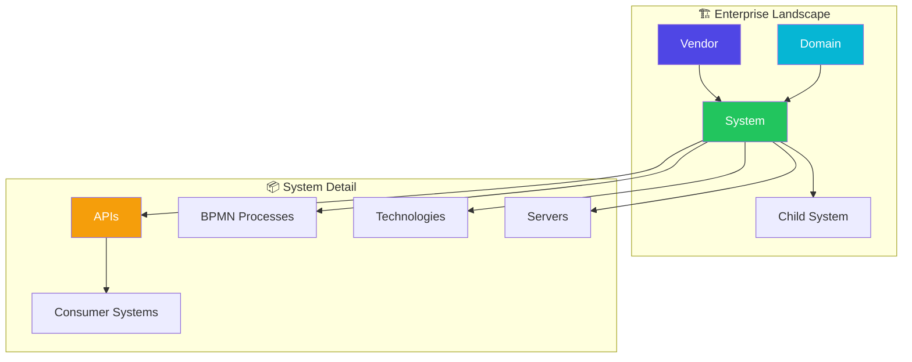
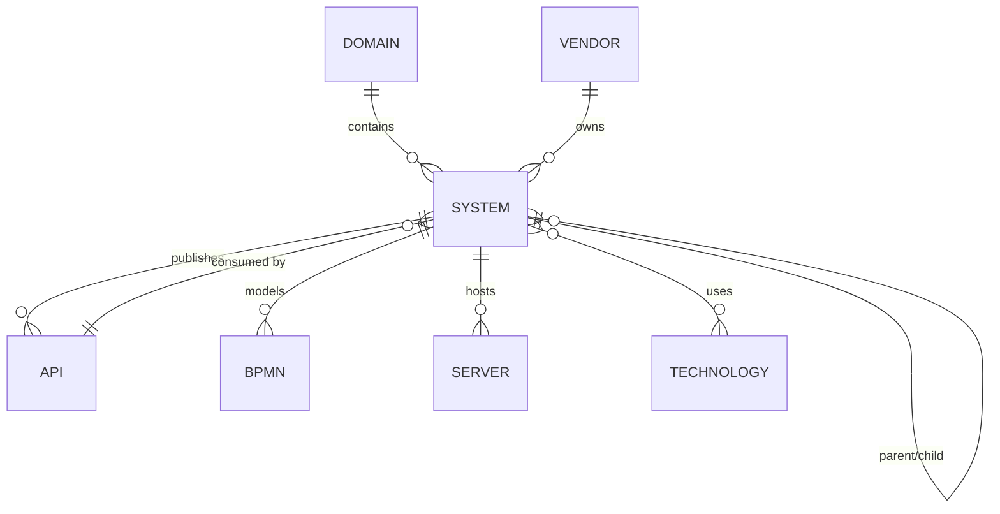
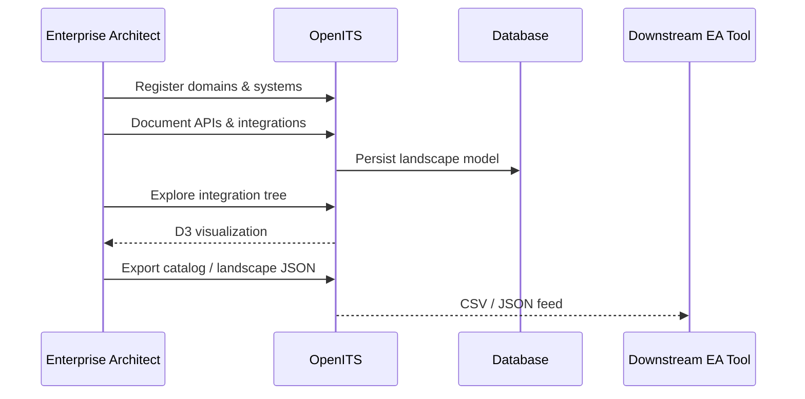
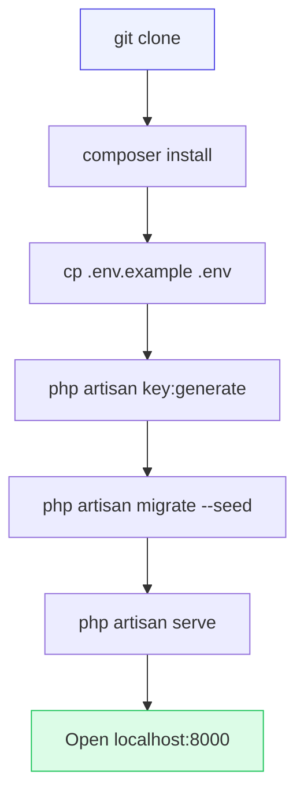
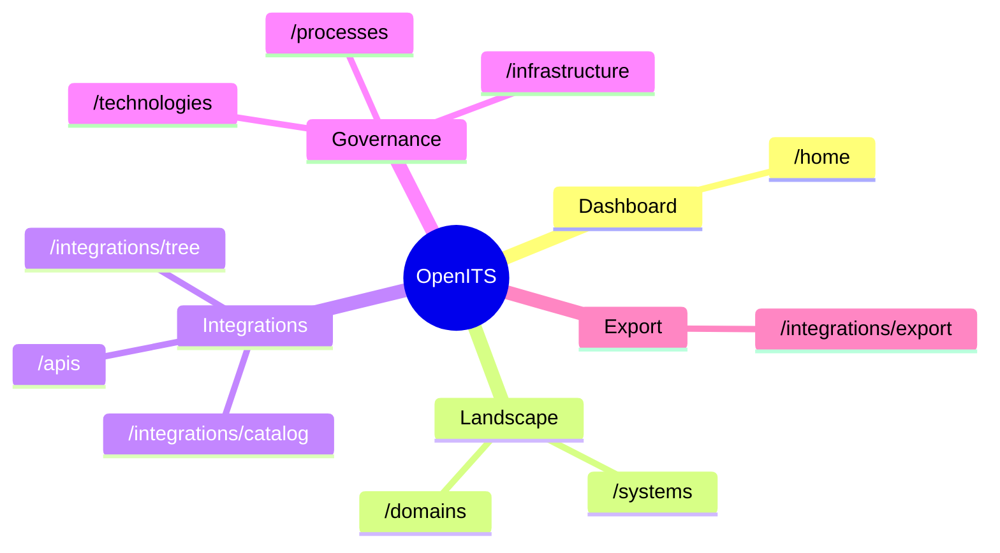
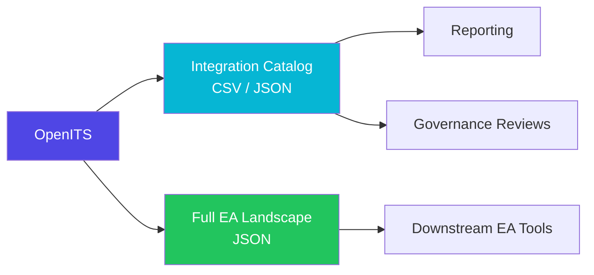
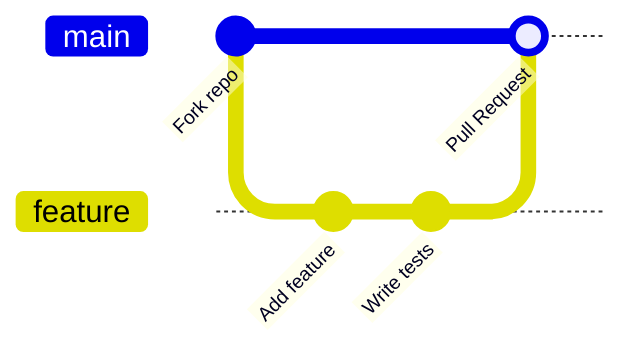

<div align="center">



# OpenITS

**Open-source enterprise architecture & integration documentation platform**

Model your IT landscape, document multi-protocol APIs, map cross-system integrations, and visualize how business domains connect — in one self-hosted workspace.

<br/>


<br/>

[](LICENSE)
[](https://openits.ir)
[](https://www.php.net/)
[](https://laravel.com/)
[](https://www.mysql.com/)
[](https://www.sqlite.org/)

<br/>

[]()
[]()
[]()
[]()
[]()
[]()
[]()

<br/>

[Features](#features) ·
[Live Demo](https://openits.ir) ·
[How It Works](#how-it-works) ·
[Quick Start](#quick-start) ·
[Architecture](#architecture-model) ·
[Logo & Brand](#logo--brand-assets) ·
[Contributing](#contributing) ·
[License](#license)

</div>

---

## About

**OpenITS** is a self-hosted platform for enterprise architects, integration teams, and platform engineers who need a single source of truth for their application landscape.

<table align="center">
  <tr>
    <td align="center" width="200">
      <br/>
      <b>Document</b><br/>
      <sub>REST, SOAP, GraphQL, gRPC, WebSocket, SSE & more</sub>
    </td>
    <td align="center" width="200">
      <br/>
      <b>Visualize</b><br/>
      <sub>Vendor → System → API → consumer maps</sub>
    </td>
    <td align="center" width="200">
      <br/>
      <b>Govern</b><br/>
      <sub>Domains, tech stacks, BPMN & infrastructure</sub>
    </td>
    <td align="center" width="200">
      <br/>
      <b>Export</b><br/>
      <sub>CSV, JSON & full landscape dumps</sub>
    </td>
  </tr>
</table>

---

## How it works



<table align="center">
  <tr>
    <td align="center" width="120">
      <br/>
      <b>1 · Model</b><br/>
      <sub>Domains &amp; systems</sub>
    </td>
    <td align="center" width="28">→</td>
    <td align="center" width="120">
      <br/>
      <b>2 · Document</b><br/>
      <sub>APIs &amp; protocols</sub>
    </td>
    <td align="center" width="28">→</td>
    <td align="center" width="120">
      <br/>
      <b>3 · Connect</b><br/>
      <sub>Integration links</sub>
    </td>
    <td align="center" width="28">→</td>
    <td align="center" width="120">
      <br/>
      <b>4 · Visualize</b><br/>
      <sub>Vendor → API tree</sub>
    </td>
    <td align="center" width="28">→</td>
    <td align="center" width="120">
      <br/>
      <b>5 · Export</b><br/>
      <sub>Catalog &amp; dumps</sub>
    </td>
  </tr>
</table>

---

## Features

<table>
  <tr>
    <td width="50%" valign="top">
      
      <b>Business domains</b><br/>
      Partition the landscape — Enterprise, Marketing, Network, Infrastructure, or custom domains.
    </td>
    <td width="50%" valign="top">
      
      <b>Vendors & systems</b><br/>
      Hierarchical application landscape with parent/child system relationships.
    </td>
  </tr>
  <tr>
    <td valign="top">
      
      <b>API & integration docs</b><br/>
      REST, SOAP, GraphQL, gRPC, WebSocket, SSE, Socket.IO, SFTP, FTPS, Zabbix, SIEM, Splunk.
    </td>
    <td valign="top">
      
      <b>Integration tree</b><br/>
      Interactive D3 visualization: Vendor → System → API → consumer systems.
    </td>
  </tr>
  <tr>
    <td valign="top">
      
      <b>Integration catalog</b><br/>
      Filterable table of all integration links with CSV/JSON export.
    </td>
    <td valign="top">
      
      <b>BPMN & sequence diagrams</b><br/>
      Process models and Mermaid-based API/integration message flow designer.
    </td>
  </tr>
  <tr>
    <td valign="top">
      
      <b>Technology stack</b><br/>
      Per-system catalog — languages, frameworks, databases, messaging, cloud.
    </td>
    <td valign="top">
      
      <b>Infrastructure</b><br/>
      Server inventory per system — DB, app, web, cache, brokers, load balancers.
    </td>
  </tr>
</table>

---

## Architecture model





<details>
<summary><b>Text representation</b></summary>

```
Vendor
  └── System (domain, parent/child hierarchy)
        ├── APIs (owner_system_id)
        │     └── consumer systems (api_system pivot)
        ├── BPMN process / Sequence diagram
        ├── technologies (pivot)
        └── servers

Domain
  └── systems
```

</details>

---

## Integration flow



---

## Requirements

<table align="center">
  <tr>
    <td align="center"></td>
    <td align="center"></td>
    <td align="center"></td>
    <td align="center"></td>
    <td align="center"></td>
  </tr>
</table>

| Dependency | Version |
|------------|---------|
| PHP | 8.2 or higher |
| Composer | Latest stable |
| Database | MySQL 8+ or SQLite |
| Node.js | 18+ *(optional, for Vite asset builds)* |

---

## Quick start

> **Live demo:** [https://openits.ir](https://openits.ir)



### 1. Clone & install

```bash
git clone https://github.com/imRezaAlie/openits.git
cd openits
composer install
```

### 2. Configure environment

```bash
cp .env.example .env
php artisan key:generate
```

Edit `.env` and set your database credentials:

```env
DB_CONNECTION=mysql
DB_HOST=127.0.0.1
DB_PORT=3306
DB_DATABASE=openits
DB_USERNAME=root
DB_PASSWORD=
```

### 3. Migrate & seed

```bash
php artisan migrate
php artisan db:seed
```

### 4. Run

```bash
php artisan serve
```

Open **[http://localhost:8000](http://localhost:8000)**, register at `/register`, then sign in to access the dashboard.

### Frontend assets *(optional)*

```bash
npm install
npm run build   # production build
npm run dev     # development with hot reload
```

---

## Demo data

Seeders populate a realistic enterprise scenario — Salesforce, SAP, Stripe, multi-protocol APIs, and cross-domain integrations:

```bash
php artisan db:seed
```

---

## Key routes



| Feature | Route |
|---------|-------|
| Dashboard | `/home` |
| Domains | `/domains` |
| Systems | `/systems` |
| API documentation | `/apis` |
| Integration tree | `/integrations/tree` |
| Integration catalog | `/integrations/catalog` |
| Full landscape export (JSON) | `/integrations/export` |
| BPMN processes | `/processes` |
| Technologies | `/technologies` |
| Infrastructure | `/infrastructure` |

> All application routes require authentication except the landing page and auth screens.

---

## Export & integration



| Export | Endpoint | Format |
|--------|----------|--------|
| Integration catalog | `/integrations/catalog/export` | CSV / JSON |
| Full EA landscape | `/integrations/export` | JSON |

---

## Tech stack

<p align="center">
  
  
  
  
  
  
  
  
</p>

| Layer | Technologies |
|-------|--------------|
| **Backend** | Laravel 11, Eloquent, Blade |
| **UI** | Bootstrap admin theme (Deznav) |
| **Visualization** | D3.js, BPMN.js, Swagger UI, Mermaid |

---

## Logo & brand assets

Official OpenITS logos are included in the repository for use in documentation, presentations, and integrations.

<table align="center">
  <tr>
    <td align="center" width="280">
      
      <br/><sub><b>Color</b> — light backgrounds</sub>
    </td>
    <td align="center" width="280" bgcolor="#1e293b">
      
      <br/><sub><b>White</b> — dark backgrounds</sub>
    </td>
  </tr>
  <tr>
    <td align="center" colspan="2">
      <br/>
      
      <br/><sub><b>Full logo</b> — admin sidebar & print layouts</sub>
    </td>
  </tr>
</table>

| Asset | Path | Usage |
|-------|------|-------|
| Color logo | `public/landing/assets/img/logo-color.png` | Light backgrounds, README, docs |
| White logo | `public/readme/logo-white.svg` | Dark backgrounds, README |
| Full logo | `public/images/logo/logo-full.png` | Admin sidebar, print layouts |
| Compact logo | `public/images/small-logo.png` | Navbar, favicons, tight spaces |
| Favicon | `public/images/favicon.png` | Browser tab icon |
| README icons | `public/readme/*.svg` | Feature & workflow illustrations |

When referencing OpenITS in external materials, please use the **color logo** on light backgrounds and the **white logo** on dark backgrounds. Do not stretch, recolor, or modify the logo proportions.

---

## Contributing



Contributions are welcome! Please open an issue to discuss significant changes before submitting a pull request.

1. **Fork** the repository
2. **Create** a feature branch (`git checkout -b feature/my-feature`)
3. **Commit** your changes (`git commit -m 'Add my feature'`)
4. **Push** to the branch (`git push origin feature/my-feature`)
5. **Open** a Pull Request

---

## License

OpenITS is open-source software licensed under the **[Apache License 2.0](LICENSE)**.

Copyright © 2026 Reza Alie

---

## Author

**Reza Alie**

- **Demo:** [openits.ir](https://openits.ir)
- **Website:** [rezaalie.ir](https://rezaalie.ir)
- **Email:** rezaalie70[at]gmail.com
- **LinkedIn:** [linkedin.com/in/rezaalie](https://www.linkedin.com/in/rezaalie)

---

<div align="center">


<br/><br/>

**[⬆ Back to top](#openits)**

<br/>

[Live Demo](https://openits.ir) · [Report a bug](https://github.com/imRezaAlie/openits/issues) · [Request a feature](https://github.com/imRezaAlie/openits/issues) · [Discussions](https://github.com/imRezaAlie/openits/discussions)

<br/>

[Website](https://rezaalie.ir) · [LinkedIn](https://www.linkedin.com/in/rezaalie) · rezaalie70[at]gmail.com

</div>
